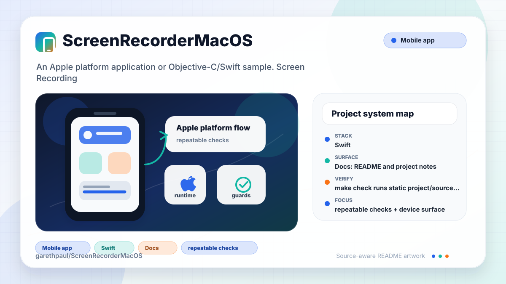

# ScreenRecorderMacOS

<!-- README-OVERVIEW-IMAGE -->


## Overview

`garethpaul/ScreenRecorderMacOS` is an Apple platform application or Objective-C/Swift sample. Screen Recording for MacOS

This README is based on the checked-in source, manifests, scripts, and repository metadata on the `main` branch. The project language mix found during review was: Swift (16).

## Repository Contents

- `README.md` - project overview and local usage notes
- `CaptureSample` - source or example code
- `CHANGES.md` - maintenance history for capture safety checks
- `Makefile` - local verification entry points
- `docs/plans` - completed maintenance plans for the current baseline
- `LICENSE` - source or example code
- `plans` - historical implementation notes
- `scripts` - static project and behavior validators
- `ScreenRecorder.xcodeproj` - Xcode project file
- `SECURITY.md` - security reporting and disclosure guidance
- `VISION.md` - project direction and maintenance guardrails

Additional scan context:

- Source directories: CaptureSample, LICENSE, ScreenRecorder.xcodeproj
- Dependency and build manifests: none detected
- Entry points or build surfaces: ScreenRecorder.xcodeproj
- Test-looking files: no obvious test files detected

## Getting Started

### Prerequisites

- Git
- macOS with Xcode for building Apple platform projects
- Python 3 for repository source checks

### Setup

```bash
git clone https://github.com/garethpaul/ScreenRecorderMacOS.git
cd ScreenRecorderMacOS
```

The setup commands above are derived from repository files. Legacy mobile, Python, or JavaScript samples may require older SDKs or package versions than a modern workstation uses by default.

## Running or Using the Project

- Open `ScreenRecorder.xcodeproj` in Xcode, choose the app or sample scheme, and run it on the matching simulator/device.

## Testing and Verification

- `make check` runs static project/source checks. When `xcodebuild` is
  installed, the `build` target also runs the shared Xcode scheme with code
  signing disabled.
- Static behavior checks cover capture crash paths, recording file URL
  creation, saved URL persistence, empty playback history handling, and
  prevention of hardcoded remote player URLs.
- Static behavior checks also reject debug logging of saved recording metadata
  or file URLs.
- Static behavior checks reject ad hoc `print(...)` logging in app Swift
  sources; use structured logging for failures that need diagnostics.
- Static behavior checks also require `CaptureEngine` to store and clear the
  active capture continuation during start/stop lifecycle handling.
- Static project checks also require completed canonical plans under `docs/plans`.
- Xcode's test action or `xcodebuild test` with the appropriate scheme and
  destination can be used on macOS for deeper verification.

When the required SDK or runtime is unavailable, use static checks and source review first, then verify on a machine that has the matching platform toolchain.

## Configuration and Secrets

- No required secret or credential file was identified in the repository scan. If you add integrations later, keep secrets out of git.

## Security and Privacy Notes

- Review changes touching authentication or token handling; examples from the scan include CaptureSample/CaptureEngine.swift.
- Review changes touching network requests, sockets, or service endpoints; examples from the scan include CaptureSample/ContentView.swift, CaptureSample/PlayerViewer.swift, ScreenRecorder.xcodeproj/.xcodesamplecode.plist.
- Review changes touching mobile permissions or privacy-sensitive device data; examples from the scan include CaptureSample/ContentView.swift, CaptureSample/ScreenRecorder.swift.
- Review changes touching file, media, JSON, XML, CSV, OCR, or data parsing; examples from the scan include CaptureSample/CaptureEngine.swift, CaptureSample/ContentView.swift, CaptureSample/Views/MenuView.swift, ScreenRecorder.xcodeproj/.xcodesamplecode.plist.
- Review changes touching shell execution, subprocess, or dynamic evaluation; examples from the scan include CaptureSample/ContentView.swift.
- Review changes touching database, model, or persistence code; examples from the scan include CaptureSample/PersistenceController.swift, CaptureSample/ScreenRecorder.swift.

## Maintenance Notes

- This looks like an Apple platform project or sample. Xcode, Swift, CocoaPods, and deployment target versions may need to match the original project era.
- See `SECURITY.md` for vulnerability reporting and safe research guidance.
- See `VISION.md` for project direction and contribution guardrails.
- See `docs/plans/2026-06-08-screen-recorder-macos-baseline.md` for the
  canonical capture and recording safety baseline.
- See `docs/plans/2026-06-08-local-player-viewer.md` for the local player
  viewer guard.
- See `docs/plans/2026-06-08-recording-log-privacy.md` for the saved recording
  metadata logging guard.
- See `docs/plans/2026-06-09-structured-app-logging.md` for the ad hoc stdout
  logging guard.
- See `docs/plans/2026-06-09-capture-continuation-lifecycle.md` for the capture
  continuation lifecycle guard.

## Contributing

Keep changes small and tied to the project that is already present in this repository. For code changes, document the toolchain used, avoid committing generated dependency directories or local configuration, and update this README when setup or verification steps change.
